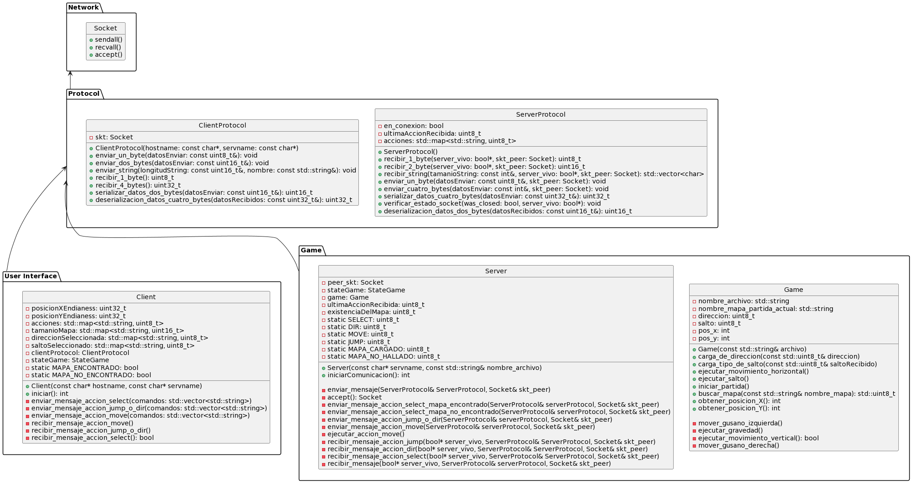
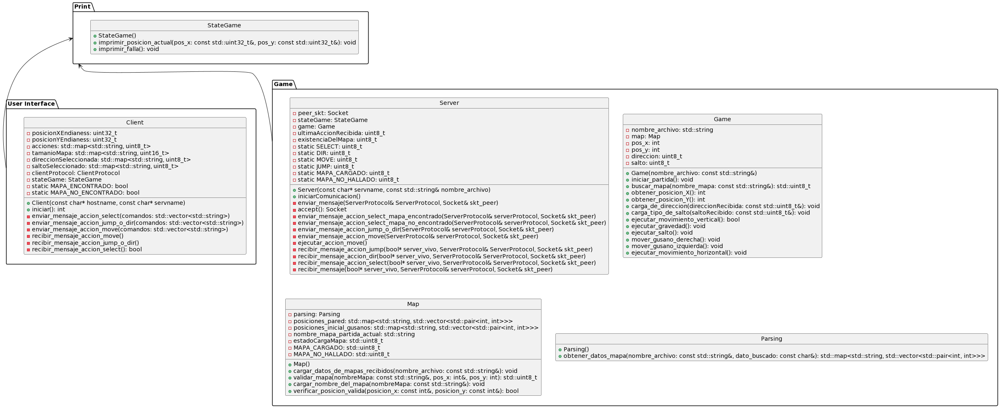

# Trabajo practico Sockets
**Ejecutar servidor**

 ./server <puerto/servicename> <escenarios>

 **Ejecutar Cliente**

 ./client <ip/hostname server> <puerto/servicename>

 **Diagrama de clases**

En el siguiente diagrama de clases, se puede observar cómo la clase Client y la clase Server se comunican entre sí a través de sus respectivas clases de protocolo utilizando Sockets. Para lograr esto, utilizan la clase Socket. En las diversas interfaces y clases del diagrama, se aprecia una clara separación de responsabilidades.

La clase Client recibe las acciones a realizar por consola, procesa estos datos y los prepara para enviar utilizando la clase ClientProtocol, esta envía estos datos a través del socket.

Por otro lado, la clase Server recibe estos datos y utiliza la clase Game para ejecutar las acciones correspondientes en el juego. Luego Server, obtiene los nuevos datos del juego y emplea la clase ServerProtocol para enviar la respuesta de vuelta al cliente.

Por otro lado, en este diagrama de clases podemos observar a la clase Parsing, Map y la clase StateGame. Se puede ver cómo la clase Game solo es responsable de realizar las acciones de juego (mover gusano, saltar, etc.). Por otro lado, los datos de la posición de las paredes son manejados por la clase Map, quien a su vez, para obtener la información de los mapas disponibles en el archivo escenarios.txt, usa la clase Parsing. Como vemos, las responsabilidades se encuentran claramente separadas.

Por último, mencionamos a la clase StateGame, que es una clase común que utilizan las clases Client y Server para imprimir por stdin las posiciones del gusano. Estas posiciones se obtuvieron a través de la clase Game en el caso de Server, y en el caso del Client, las posiciones fueron obtenidas por los mensajes que llegan desde el servidor a través de la clase ServerProtocol.

**Aclaración respecto del ingreso de comandos por parte del cliente**
Si el usuario ingresa una acción distinta a *select*, *dir*, *move* o *jump*, un nombre de mapa distinto a los posibles esperados, o una dirección y ejecución de salto diferente de *0* y *1*, no se realiza ningún tipo de operación. El programa continúa esperando que ingreses un comando y una dirección válida.

